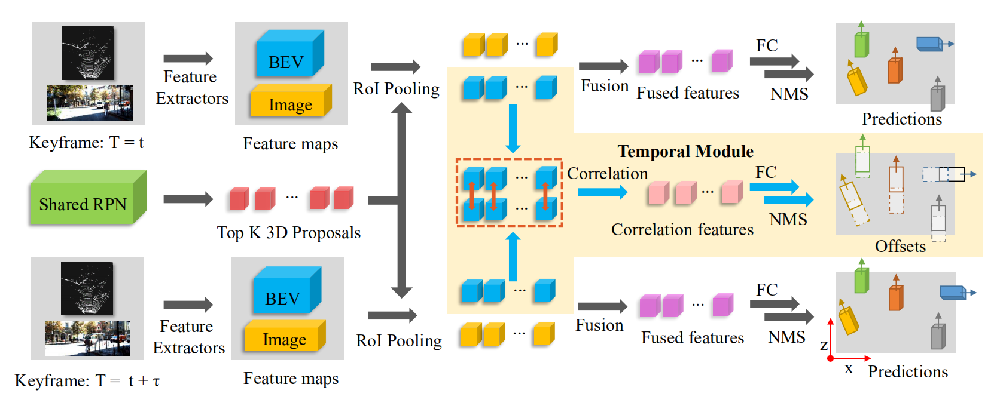

# 3D Object Detection and Tracking Based on Streaming Data



This Paper is accepted by **ICRA 2020**. This repository is based on **AVOD** peoject.

[**Joint 3D Proposal Generation and Object Detection from View Aggregation**](https://arxiv.org/abs/1712.02294)
[Jason Ku](https://github.com/kujason), [Melissa Mozifian](https://melfm.github.io/), [Jungwook Lee](https://github.com/jungwook-lee), [Ali Harakeh](https://www.aharakeh.com/), [Steven L. Waslander](https://scholar.google.ca/citations?user=CwgGTXMAAAAJ)

## 3D object detection results on streaming data

<table>
   <tr>
      <td colspan="2" style="text-align:center;vertical-align:middle;">-</td>
      <td colspan="3" style="text-align:center;vertical-align:middle;">IOU = 0.5</td>
      <td colspan="3" style="text-align:center;vertical-align:middle;">IOU = 0.7</td>
      <td colspan="1" style="text-align:center;vertical-align:middle;">-</td>
   <tr>
   <tr>
      <td style="text-align:center;vertical-align:middle;">Methods</td>
      <td style="text-align:center;vertical-align:middle;">Modules</td>
      <td style="text-align:center;vertical-align:middle;">Easy</td>
      <td style="text-align:center;vertical-align:middle;">Moderate</td>
      <td style="text-align:center;vertical-align:middle;">Hard</td>
      <td style="text-align:center;vertical-align:middle;">Easy</td>
      <td style="text-align:center;vertical-align:middle;">Moderate</td>
      <td style="text-align:center;vertical-align:middle;">Hard</td>
      <td style="text-align:center;vertical-align:middle;">FPS</td>
   </tr>
    <tr>
      <td style="text-align:center;vertical-align:middle;">AVOD</td>
      <td style="text-align:center;vertical-align:middle;">-</td>
      <td style="text-align:center;vertical-align:middle;">90.13 / 90.91</td>
      <td style="text-align:center;vertical-align:middle;">80.00 / 81.79</td>
      <td style="text-align:center;vertical-align:middle;">71.61 / 81.79</td>
      <td style="text-align:center;vertical-align:middle;">76.00 / 90.90</td>
      <td style="text-align:center;vertical-align:middle;">57.23 / 81.73</td>
      <td style="text-align:center;vertical-align:middle;">56.13 / 72.69</td>
      <td style="text-align:center;vertical-align:middle;">10.0</td>
    </tr>
    <tr>
      <td style="text-align:center;vertical-align:middle;">DODT(τ = 1)</td>
      <td style="text-align:center;vertical-align:middle;">S</td>
      <td style="text-align:center;vertical-align:middle;">88.28 / 99.97</td>
      <td style="text-align:center;vertical-align:middle;">85.74 / 90.90</td>
      <td style="text-align:center;vertical-align:middle;">86.14 / 90.89</td>
      <td style="text-align:center;vertical-align:middle;">83.44 / 90.82</td>
      <td style="text-align:center;vertical-align:middle;">67.48 / 90.79</td>
      <td style="text-align:center;vertical-align:middle;">61.24 / 90.80</td>
      <td style="text-align:center;vertical-align:middle;">6.7</td>
    </tr>
    <tr>
      <td style="text-align:center;vertical-align:middle;">DODT(τ = 1)</td>
      <td style="text-align:center;vertical-align:middle;">S + T</td>
      <td style="text-align:center;vertical-align:middle;">88.32 / <b>99.99</b></td>
      <td style="text-align:center;vertical-align:middle;">86.53 / <b>99.90</b></td>
      <td style="text-align:center;vertical-align:middle;">86.53 / 90.90</td>
      <td style="text-align:center;vertical-align:middle;">83.60 / 90.82</td>
      <td style="text-align:center;vertical-align:middle;">68.93 / 90.80</td>
      <td style="text-align:center;vertical-align:middle;">62.69 / 90.81</td>
      <td style="text-align:center;vertical-align:middle;">5.9</td>
    </tr>
    <tr>
      <td style="text-align:center;vertical-align:middle;">DODT(τ = 1)</td>
      <td style="text-align:center;vertical-align:middle;">S + M</td>
      <td style="text-align:center;vertical-align:middle;">89.99 / 99.95</td>
      <td style="text-align:center;vertical-align:middle;">87.86 / 90.87</td>
      <td style="text-align:center;vertical-align:middle;">87.81 / 90.86</td>
      <td style="text-align:center;vertical-align:middle;">86.89 / 90.89</td>
      <td style="text-align:center;vertical-align:middle;">73.96 / 90.83</td>
      <td style="text-align:center;vertical-align:middle;">67.07 / 81.79</td>
      <td style="text-align:center;vertical-align:middle;">6.5</td>
    </tr>
    <tr>
      <td style="text-align:center;vertical-align:middle;">DODT(τ = 1)</td>
      <td style="text-align:center;vertical-align:middle;">S + T + M</td>
      <td style="text-align:center;vertical-align:middle;"><b>90.63</b> / 99.95</td>
      <td style="text-align:center;vertical-align:middle;">89.07 / 90.90</td>
      <td style="text-align:center;vertical-align:middle;">88.79 / <b>90.90</b></td>
      <td style="text-align:center;vertical-align:middle;">88.74 / 90.91</td>
      <td style="text-align:center;vertical-align:middle;">75.27 / 90.84</td>
      <td style="text-align:center;vertical-align:middle;">68.75 / 90.57</td>
      <td style="text-align:center;vertical-align:middle;">5.7</td>
    </tr>
    <tr>
      <td style="text-align:center;vertical-align:middle;">DODT(τ = 2)</td>
      <td style="text-align:center;vertical-align:middle;">S + T + M</td>
      <td style="text-align:center;vertical-align:middle;">90.60 / 99.94</td>
      <td style="text-align:center;vertical-align:middle;"><b>89.19</b> / <b>90.91</b></td>
      <td style="text-align:center;vertical-align:middle;"><b>88.91</b> / 90.88</td>
      <td style="text-align:center;vertical-align:middle;"><b>88.90</b> / <b>90.92</b></td>
      <td style="text-align:center;vertical-align:middle;"><b>76.64</b> / 90.85</td>
      <td style="text-align:center;vertical-align:middle;">75.81 / 90.83</td>
      <td style="text-align:center;vertical-align:middle;">8.6</td>
    </tr>
    <tr>
      <td style="text-align:center;vertical-align:middle;">DODT(τ = 3)</td>
        <td style="text-align:center;vertical-align:middle;">S + T + M</td>
      <td style="text-align:center;vertical-align:middle;">90.61 / 99.98</td>
      <td style="text-align:center;vertical-align:middle;">89.01 / 90.89</td>
      <td style="text-align:center;vertical-align:middle;">88.84 / 90.89</td>
      <td style="text-align:center;vertical-align:middle;">88.81 / 90.91</td>
      <td style="text-align:center;vertical-align:middle;">76.38 / <b>90.86</b></td>
      <td style="text-align:center;vertical-align:middle;"><b>75.83</b> / <b>90.85</b></td>
      <td style="text-align:center;vertical-align:middle;">11.4</td>
    </tr>
    <tr>
      <td style="text-align:center;vertical-align:middle;">DODT(τ = 4)</td>
      <td style="text-align:center;vertical-align:middle;">S + T + M</td>
      <td style="text-align:center;vertical-align:middle;">90.55 / 99.94</td>
      <td style="text-align:center;vertical-align:middle;">88.82 / 90.88</td>
      <td style="text-align:center;vertical-align:middle;">88.34 / 90.87</td>
      <td style="text-align:center;vertical-align:middle;">88.43 / 90.91</td>
      <td style="text-align:center;vertical-align:middle;">75.70 / 90.82</td>
      <td style="text-align:center;vertical-align:middle;">68.75 / 90.82</td>
      <td style="text-align:center;vertical-align:middle;">14.3</td>
    </tr>
    <tr>
      <td style="text-align:center;vertical-align:middle;">DODT(τ = 5)</td>
      <td style="text-align:center;vertical-align:middle;">S + T + M</td>
      <td style="text-align:center;vertical-align:middle;">87.98 / 90.91</td>
      <td style="text-align:center;vertical-align:middle;">85.57 / 90.87</td>
      <td style="text-align:center;vertical-align:middle;">86.01 / 90.87</td>
      <td style="text-align:center;vertical-align:middle;">81.59 / 90.81</td>
      <td style="text-align:center;vertical-align:middle;">67.30 / 90.76</td>
      <td style="text-align:center;vertical-align:middle;">61.35 / 81.73</td>
      <td style="text-align:center;vertical-align:middle;">17.1</td>
    </tr>
    <tr>
      <td style="text-align:center;vertical-align:middle;">DODT(τ = 6)</td>
      <td style="text-align:center;vertical-align:middle;">S + T + M</td>
      <td style="text-align:center;vertical-align:middle;">78.77 / 90.75</td>
      <td style="text-align:center;vertical-align:middle;">70.88 / 90.71</td>
      <td style="text-align:center;vertical-align:middle;">71.65 / 81.70</td>
      <td style="text-align:center;vertical-align:middle;">71.71 / 90.44</td>
      <td style="text-align:center;vertical-align:middle;">55.86 / 81.50</td>
      <td style="text-align:center;vertical-align:middle;">56.80 / 81.51</td>
      <td style="text-align:center;vertical-align:middle;"><b>20.0</b></td>
    </tr>
</table>
We report $AP_{3D}/AP_{BEV}$  (in %) of the Car category on validation datasets, corresponding to average precision of 3D object detection in 3D view and in BEV view. **S** is Shared RPN Module, **T** is Temporal Module, **M** is our MoI algorithm, and **τ** is temporal stride.

## 3D multiple tracking results

<table>
   <tr>
      <td style="text-align:center;vertical-align:middle;">Methods</td>
       <td style="text-align:center;vertical-align:middle;">Modules</td>
      <td style="text-align:center;vertical-align:middle;">MOTA(%)↑</td>
      <td style="text-align:center;vertical-align:middle;">MOTP(%)↑</td>
      <td style="text-align:center;vertical-align:middle;">MT(%)↑</td>
      <td style="text-align:center;vertical-align:middle;">ML(%)↓</td>
      <td style="text-align:center;vertical-align:middle;">IDS↓</td>
      <td style="text-align:center;vertical-align:middle;">FM↓</td>
   </tr>
    <tr>
      <td style="text-align:center;vertical-align:middle;">AVOD</td>
      <td style="text-align:center;vertical-align:middle;">-</td>
      <td style="text-align:center;vertical-align:middle;">66.05</td>
      <td style="text-align:center;vertical-align:middle;">82.97</td>
      <td style="text-align:center;vertical-align:middle;">46.22</td>
      <td style="text-align:center;vertical-align:middle;">12.18</td>
      <td style="text-align:center;vertical-align:middle;"><b>2</b></td>
      <td style="text-align:center;vertical-align:middle;">113</td>
    </tr>
    <tr>
      <td style="text-align:center;vertical-align:middle;">DODT(τ = 3)</td>
      <td style="text-align:center;vertical-align:middle;">S</td>
      <td style="text-align:center;vertical-align:middle;">76.53</td>
        <td style="text-align:center;vertical-align:middle;"><b>83.93</b></td>
      <td style="text-align:center;vertical-align:middle;">68.91</td>
      <td style="text-align:center;vertical-align:middle;">7.14</td>
      <td style="text-align:center;vertical-align:middle;">32</td>
      <td style="text-align:center;vertical-align:middle;">80</td>
    </tr>
    <tr>
      <td style="text-align:center;vertical-align:middle;">DODT(τ = 3)</td>
      <td style="text-align:center;vertical-align:middle;">S + T</td>
      <td style="text-align:center;vertical-align:middle;">77.52</td>
      <td style="text-align:center;vertical-align:middle;">83.75</td>
      <td style="text-align:center;vertical-align:middle;">69.33</td>
      <td style="text-align:center;vertical-align:middle;">7.56</td>
      <td style="text-align:center;vertical-align:middle;">37</td>
      <td style="text-align:center;vertical-align:middle;">77</td>
    </tr>
    <tr>
      <td style="text-align:center;vertical-align:middle;">DODT(τ = 3)</td>
      <td style="text-align:center;vertical-align:middle;">S + M</td>
      <td style="text-align:center;vertical-align:middle;">78.73</td>
      <td style="text-align:center;vertical-align:middle;"><b>83.93</b></td>
      <td style="text-align:center;vertical-align:middle;">68.49</td>
      <td style="text-align:center;vertical-align:middle;">9.55</td>
      <td style="text-align:center;vertical-align:middle;"><b>2</b></td>
      <td style="text-align:center;vertical-align:middle;"><b>48</b></td>
    </tr>
     <tr>
      <td style="text-align:center;vertical-align:middle;">DODT(τ = 3)</td>
      <td style="text-align:center;vertical-align:middle;">S + T + M</td>
      <td style="text-align:center;vertical-align:middle;"><b>79.72</b></td>
      <td style="text-align:center;vertical-align:middle;">83.55</td>
       <td style="text-align:center;vertical-align:middle;"><b>71.85</b></td>
       <td style="text-align:center;vertical-align:middle;"><b>5.46</b></td>
      <td style="text-align:center;vertical-align:middle;">7</td>
      <td style="text-align:center;vertical-align:middle;">66</td>
    </tr>
</table>

Ablation study on KITTI Tracking validation datasets. **S** is Shared RPN Module, **T** is Temporal Module, **M** is our MoI algorithm, and **τ** is temporal stride.


<table>
   <tr>
      <td style="text-align:center;vertical-align:middle;">Methods</td>
      <td style="text-align:center;vertical-align:middle;">MOTA(%)↑</td>
      <td style="text-align:center;vertical-align:middle;">MOTP(%)↑</td>
      <td style="text-align:center;vertical-align:middle;">MT(%)↑</td>
      <td style="text-align:center;vertical-align:middle;">ML(%)↓</td>
      <td style="text-align:center;vertical-align:middle;">IDS↓</td>
      <td style="text-align:center;vertical-align:middle;">FM↓</td>
      <td style="text-align:center;vertical-align:middle;">FPS</td>
   </tr>
    <tr>
      <td style="text-align:center;vertical-align:middle;">Complexer-YOLO</td>
      <td style="text-align:center;vertical-align:middle;">75.70</td>
      <td style="text-align:center;vertical-align:middle;">78.46</td>
      <td style="text-align:center;vertical-align:middle;">58.00</td>
      <td style="text-align:center;vertical-align:middle;">5.08</td>
      <td style="text-align:center;vertical-align:middle;">1186</td>
      <td style="text-align:center;vertical-align:middle;">2096</td>
      <td style="text-align:center;vertical-align:middle;"><b>100.0</b></td>
    </tr>
    <tr>
      <td style="text-align:center;vertical-align:middle;">DSM</td>
      <td style="text-align:center;vertical-align:middle;">76.15</td>
      <td style="text-align:center;vertical-align:middle;">83.42</td>
      <td style="text-align:center;vertical-align:middle;">60.00</td>
      <td style="text-align:center;vertical-align:middle;">8.31</td>
      <td style="text-align:center;vertical-align:middle;">296</td>
      <td style="text-align:center;vertical-align:middle;">868</td>
      <td style="text-align:center;vertical-align:middle;">10.0(GPU)</td>
    </tr>
    <tr>
      <td style="text-align:center;vertical-align:middle;">3D-CNN/PMBM</td>
      <td style="text-align:center;vertical-align:middle;">80.39</td>
      <td style="text-align:center;vertical-align:middle;">81.26</td>
      <td style="text-align:center;vertical-align:middle;">62.77</td>
      <td style="text-align:center;vertical-align:middle;">6.15</td>
      <td style="text-align:center;vertical-align:middle;">121</td>
      <td style="text-align:center;vertical-align:middle;">613</td>
      <td style="text-align:center;vertical-align:middle;">71.4</td>
    </tr>
    <tr>
      <td style="text-align:center;vertical-align:middle;">3DT</td>
      <td style="text-align:center;vertical-align:middle;"><b>84.52</b></td>
      <td style="text-align:center;vertical-align:middle;"><b>85.64</b></td>
      <td style="text-align:center;vertical-align:middle;"><b>73.38</b></td>
      <td style="text-align:center;vertical-align:middle;"><b>2.77</b></td>
      <td style="text-align:center;vertical-align:middle;">377</td>
      <td style="text-align:center;vertical-align:middle;">847</td>
      <td style="text-align:center;vertical-align:middle;">33.3</td>
    </tr>
     <tr>
      <td style="text-align:center;vertical-align:middle;">DODT(ours)</td>
      <td style="text-align:center;vertical-align:middle;">76.68</td>
      <td style="text-align:center;vertical-align:middle;">81.65</td>
      <td style="text-align:center;vertical-align:middle;">60.77</td>
      <td style="text-align:center;vertical-align:middle;">11.69</td>
      <td style="text-align:center;vertical-align:middle;"><b>63</b></td>
      <td style="text-align:center;vertical-align:middle;"><b>384</b></td>
      <td style="text-align:center;vertical-align:middle;">76.9</td>
    </tr>
</table>

Comparison of publicly available methods of 3D multiple object tracking in the KITTI Tracking Benchmark. [Complexer-YOLO](https://arxiv.org/abs/1904.07537), [DSM](https://arxiv.org/abs/1806.11534), [3D-CNN/PMBM](https://doi.org/10.1109/IVS.2018.8500454),  [3DT](https://arxiv.org/abs/1811.10742). The time for object detection is not included in the specified runtime.

## Getting Started

Implemented and tested on Ubuntu 16.04 with Python 3.5 and Tensorflow 1.3.0.

For visualization, you should install Mayavi. Ref: http://docs.enthought.com/mayavi/mayavi/installation.html.

```bash
sudo apt-get install python-vtk python-qt4 python-qt4-gl python-setuptools python-numpy python-configobj
sudo pip install mayavi
pip install PyQt5
```

1. Clone this repo

```bash
git clone http://www.usilab.cn:10080/guoxs/dodt.git --recurse-submodules
```

If you forget to clone the wavedata submodule:

```bash
git submodule update --init --recursive
```

2. Install Python dependencies

```bash
cd avod
pip3 install -r requirements.txt
pip3 install tensorflow-gpu==1.3.0
```

3. Add `avod (top level)` and `wavedata` to your PYTHONPATH

```bash
# For virtualenvwrapper users
add2virtualenv .
add2virtualenv wavedata
```

```bash
# For nonvirtualenv users
export PYTHONPATH=$PYTHONPATH:'/path/to/avod'
export PYTHONPATH=$PYTHONPATH:'/path/to/avod/wavedata'
```

4. Compile integral image library in wavedata

```bash
sh scripts/install/build_integral_image_lib.bash
```

5. DODT uses Protobufs to configure model and training parameters. Before the framework can be used, the protos must be compiled (from top level avod folder):

```bash
sh avod/protos/run_protoc.sh
```

Alternatively, you can run the `protoc` command directly:

```bash
protoc avod/protos/*.proto --python_out=.
```

## Training

### Datasets

the `kitti` folder including two kind of datasets samples currently, `detection`  ([3D Object Detection Evaluation 2017](http://www.cvlibs.net/datasets/kitti/eval_object.php?obj_benchmark=3d)) and `tracking` ([Object Tracking Evaluation 2012](http://www.cvlibs.net/datasets/kitti/eval_tracking.php)).

The dataset folders should look something like the following:

    kitti
        detection
            testing
            training
                calib         # calibration files
                image_2       # left images, 10 pngs
                label_2       # kitti label files
                velodyne      # point cloud files, 10 bins
        tracking
            testing           # 1 video, has 10 frames
            training          # 2 videos, each has 10 frames
                calib
                image_2
                label_2
                oxts          # GPS/IMU data
                velodyne
### Mini-batch Generation

The training data needs to be pre-processed to generate mini-batches for the RPN. To configure the mini-batches, you can modify `avod/configs/mb_preprocessing/rpn_[class].config`. You also need to select the *class* you want to train on. Inside the `scripts/preprocessing/gen_mini_batches.py` select the classes to process. By default it processes the *Car* class, where the flag `process_[class]` is set to True. The People class includes both Pedestrian and Cyclists. You can also generate mini-batches for a single class such as *Pedestrian* only.

Note: This script does parallel processing with `num_[class]_children` processes for faster processing. This can also be disabled inside the script by setting `in_parallel` to `False`.

```bash
cd avod
python scripts/preprocessing/gen_tracking_mini_batches.py
```

Once this script is done, you should now have the following folders inside `avod/data`:

```
data
    label_clusters
    mini_batches
```

### Training Configuration

There are sample configuration files for training inside `avod/configs`. You can train on the example configs, or modify an existing configuration. To train a new configuration, copy a config, e.g. `pyramid_cars_with_aug_example.config`, rename this file to a unique experiment name and make sure the file name matches the `checkpoint_name: 'pyramid_cars_with_aug_example'` entry inside your config.

### Run Trainer

To start training, run the following:

```bash
python avod/experiments/run_stack_tracking_training.py --pipeline_config=avod/configs/pyramid_cars_with_aug_dt_5_tracking.config
```

(Optional) Training defaults to using GPU device 1, and the `train` split. You can specify using the GPU device and data split as follows:

```bash
python avod/experiments/run_stack_tracking_training.py --pipeline_config=avod/configs/pyramid_cars_with_aug_dt_5_tracking.config  --device='0' --data_split='train'
```

### Run Evaluator

To start evaluation, run the following:

```bash
python avod/experiments/run_stack_tracking_evaluation.py --pipeline_config=avod/configs/pyramid_cars_with_aug_dt_5_tracking.config
```

(Optional) With additional options:

```bash
python avod/experiments/run_stack_tracking_evaluation.py --pipeline_config=avod/configs/pyramid_cars_with_aug_dt_5_tracking.config --device='0' --data_split='val'
```

The evaluator has two main modes, you can either evaluate a single checkpoint, a list of indices of checkpoints, or repeatedly. The evaluator is designed to be run in parallel with the trainer on the same GPU, to repeatedly evaluate checkpoints. This can be configured inside the same config file (look for `eval_config` entry).

To view the TensorBoard summaries:

```bash
cd avod/data/outputs/pyramid_cars_with_aug_dt_5_tracking
tensorboard --logdir logs
```

Note: In addition to evaluating the loss, calculating accuracies, etc, the evaluator also runs the KITTI native evaluation code on each checkpoint. Predictions are converted to KITTI format and the AP is calculated for every checkpoint. The results are saved inside `scripts/offline_eval/results/pyramid_cars_with_aug_example_results_0.1.txt` where `0.1` is the score threshold. IoUs are set to (0.7, 0.5, 0.5) 

### Run Inference

To run inference on the `val` split, run the following script:

```bash
python avod/experiments/run_tracking_inference.py --checkpoint_name='pyramid_cars_with_aug_dt_5_tracking' --data_split='val' --ckpt_indices=120 --device='1'
```

The `ckpt_indices` here indicates the indices of the checkpoint in the list. If the `checkpoint_interval` inside your config is `1000`, to evaluate checkpoints `116000` and `120000`, the indices should be `--ckpt_indices=116 120`. You can also just set this to `-1` to evaluate the last checkpoint.

### Run multiple object tracking

To generate MOT results, run the following script:

```bash
python avod/experiments/video_detection.py --pipeline_config="pyramid_cars_with_aug_dt_5_tracking" --ckpt_indices="120000" --stride=3
```

### Viewing Results

All results should be saved in `avod/data/outputs`. Here you should see `proposals_and_scores` and `final_predictions_and_scores` results. To visualize these results, you can run `demos/show_predictions_2d.py`. The script needs to be configured to your specific experiments. The `scripts/offline_eval/plot_ap.py` will plot the AP vs. step, and print the 5 highest performing checkpoints for each evaluation metric at the moderate difficulty.

We provided some 3D visualization tools for point clouds, please check scripts  `viz/viz_test.py` and `viz/stack_viz_test.py`.

We also provided a script for results visualization in BEV, please check the scripts `viz/prediction_review.py`.