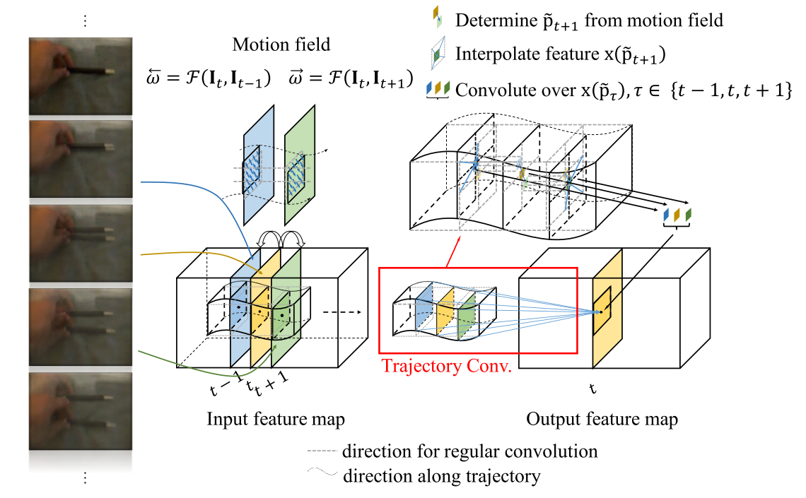

## 周报 2018-05-08  郭叙森

周末和老师讨论了项目进一步的研究计划，在此我大致罗列下：

- 分析目前模型在哪些场景下效果不好，为什么不好。其他方法是怎么克服这些问题的？我们的模型该怎么改进以改进这些场景的追踪性能？
- 针对目标在前一关键帧没有而后一关键帧出现（或者相反）的情况，该如何解决？能否通过灵活选取关键帧解决？如何更有效的选取关键帧？
- Correlation 模块有没有更合理的实现？目前还只是用了两帧的信息，如何将提取轨迹的特征改善目标检测以及追踪性能? 
- 之前初步分析发现现在使用的 AVOD 框架传感器融合模块可以改进。目前只是简单的特征叠加，并没有加入几何先验知识。

以上是上周末讨论提出的四个问题，这几天我在整理实验代码的同时也大致分析了一下。

① 针对第一个问题，分析模型在验证集上的结果，大致可以整理出三类检测/追踪失败的情况（**最后会给出这几种情况的图例**）：

- 目标的点云图上没有或者几乎没有点，而在图像上在视野的较远处，像素占比很小，属于小物体检测范围。虽然AVOD有相应的改进应对小目标检测，但实际效果看起来还是不够好。
- 目标在点云图上点很少或者没有，而在图像上被其他物体遮挡/部分遮挡。如果物体之前一直没有没检测到，可能没有什么好的方法；如果物体是中途没遮挡，则可以通过轨迹信息补全。
- 目标在点云图上有比较多的点，但在图像上超出了画面（物体靠近激光雷达，图像上被截断）。这种情况按理说不应该出现，因为我们是在三维上进行物体检测，图像只是提供额外的特征。不过也有也可能是物体在图像上被截断影响了特征表达，最后识别失败。这种情况需要进一步探究。

② 关键帧选取算法打算借鉴视频处理的一些方法，目前还没有深入探索。

③ Correlation 模块的改进感觉可以参考轨迹卷积（示意图如下）.  原论文是做视频动作识别的，我们做目标检测感觉还需要在很多地方改进。目前也还没进一步探究。 

④ 对于传感器融合的改进，目前先交给了古剑锋和郭思璐两人。目前大致的想法是先就 AVOD 做三组实验，只用 Image， 只用点云，和同时用图像与点云看看效果差异大不大。对于新的数据融合方法，我们打算使用 KITTI 数据集上左右图像（之前用的图像都是左图像，即左摄像头拍的图像，KITTI 数据集还有相对应的右图像）计算的到深度图然后和点云融合。具体怎么融合还没有想好，一种值得尝试的方法是将远处没有点的区域用图像计算的深度图填充。

**四种漏检情况**

**绿框为真实标签**，其他颜色为预测结果，不同颜色代表不同车辆轨迹。由于真实标签只画了“Car”（小轿车）, 其他车型如 “Van” 并没有考虑在内，所以会有一些没有真实框却有预测框的情况，由于这些不影响检测结果，所以这里忽略之。

case 1

case 2

case 3

