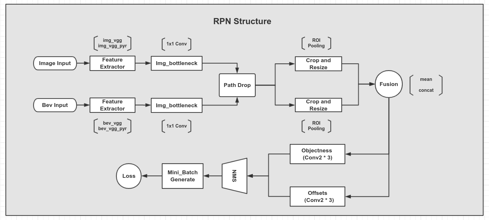
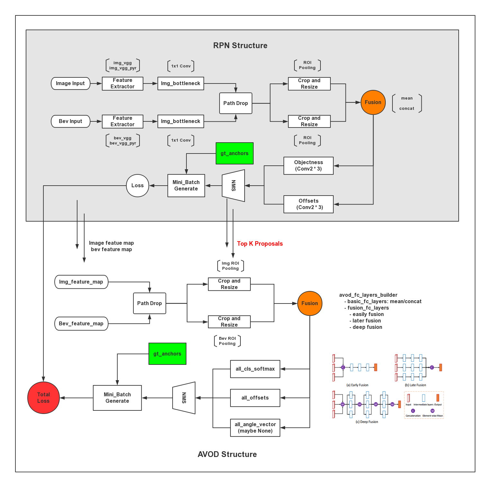

## AVOD code

## Main Part

> experiments/run_training.py

- Preprocessing
- Config Pipeline
- Dataset Builder
- Model Builder
- Trainer

### Preprocessing, 预处理部分

- script/preprocessing  多线程处理

**gen_mini_batches.py 为主文件**

> gen_mini_batches.py --> mini_batch_utils.py --> mini_batch_preprocessor.py

生成 label cluster 文件以及 roi mini batches.
生成的文件位于 /data/label_clusters 与 /data/mini_batches 目录下.

mini_batches 目录下为每个数据的 anchors_info:
```
lists:[
    max_gt_2d_iou: highest 2D iou with any ground truth box
    max_gt_3d_iou: highest 3D iou with any ground truth box
    offsets:       encoded offsets [dx, dy, dz, d_dimx, d_dimy, d_dimz]
    class_index:   the anchor's class as an index(e.g. 0 or 1, for "Background" or "Car")
]
```

其中：
```
    d_dimx = l * cos(ry) + w * sin(ry)
    d_dimy = h
    d_dimz = w * cos(ry) + l * sin(ry)
```

### Config Pipeline, 配置文件解析部分

> config_builder_util.py --> pipeline_pb2/model_pb2.py

including four part: 

- model_config
- train_config
- eval_config
- dataset_config

avod 用到了 Protobuf, 是一种平台无关, 语言无关, 可扩展且轻便高效的序列化数据结构的协议, 可以用于网络通信和数据存储.

有许多 config 对象的默认值会在 proto 文件中设置
    

### Dataset Builder 部分

**kitti_dataset.py 为主文件**

> kitti_dataset.py --> kitti_utils.py --> label_cluster_utils/mini_batch_utils.py

main function: load_samples

```
sample_dict = {
    constants.KEY_LABEL_BOXES_3D: label_boxes_3d:  ndarray [n, 7], (x, y, z, l, w, h, ry)
    constants.KEY_LABEL_ANCHORS: label_anchors  :  ndarray [n, 6], [x, y, z, dim_x, dim_y, dim_z]
    constants.KEY_LABEL_CLASSES: label_classes  :  ndarray [n,]  a integer index encoder object class type

    constants.KEY_IMAGE_INPUT: image_input      :  image after augmentation, [h, w, 3] in RGB mode
    constants.KEY_BEV_INPUT: bev_input          :  lidar bev, [bev_h, bev_w, 6], 5 height map + 1 density map

    constants.KEY_ANCHORS_INFO: anchors_info    :  anchors_info generated by preprocessing

    constants.KEY_POINT_CLOUD: point_cloud      :  lidar points that can be projected to image plane
    constants.KEY_GROUND_PLANE: ground_plane    :  ground plane, [1, 4], need pre-generated
    constants.KEY_STEREO_CALIB_P2: stereo_calib_p2: camera_2 projection matrix

    constants.KEY_SAMPLE_NAME: sample_name:     :  sample name, eg. '000000'
    constants.KEY_SAMPLE_AUGS: sample.augs      :   augmentation methods list, ['flip', 'jitter']
}
```

next_batch: return the next 'batch_size' samples from the datasets

> avod 所用坐标系完全基于 kitti 数据集

model.DetectionModel (抽象类)
    - AvodModel
    - RpnModel

### Model Builder 部分

> avod_model.py --> rpn_model.py

RPN model 是 AVOD model 的一个子集, 但也是一个单独的模型, 可以直接拿来训练


#### RPN model
```
class RpnModel
    - set placeholder name
    - __init__()
    - build()
        - _set_up_input_pls()           Setup input placeholders
        - _set_up_feature_extractors()  Setup feature extractors
    - create_feed_dict()                Fills in the placeholders with the actual input values
    - loss()
```




#### AVOD model

```
class AvodModel:
    - set placeholder name
    - __init__()
    - build()
        - rpn_model.build()
    - sample_mini_batch()
    - create_feed_dict()
    - loss()
```


